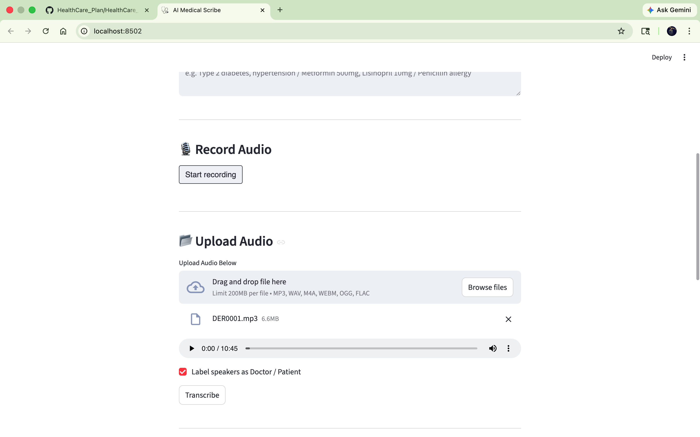
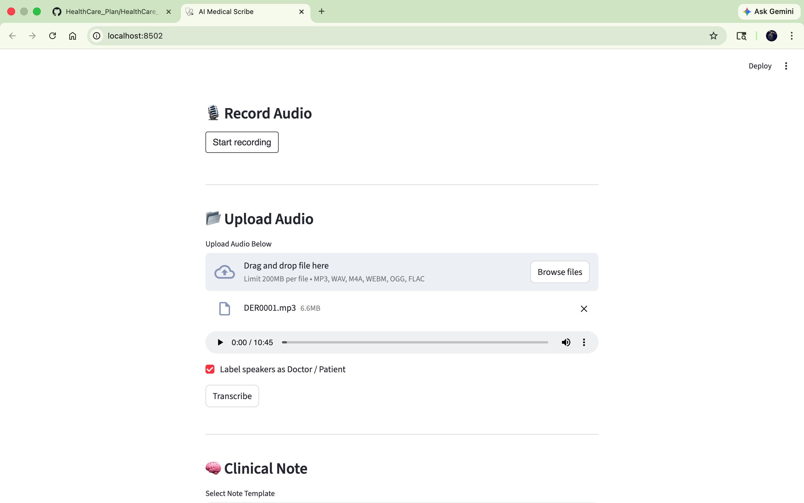
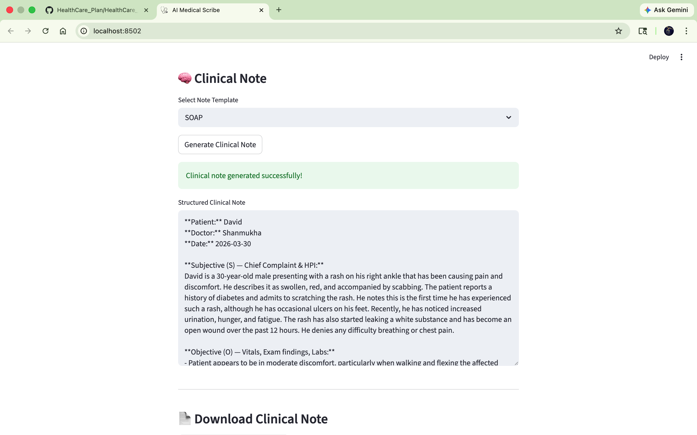
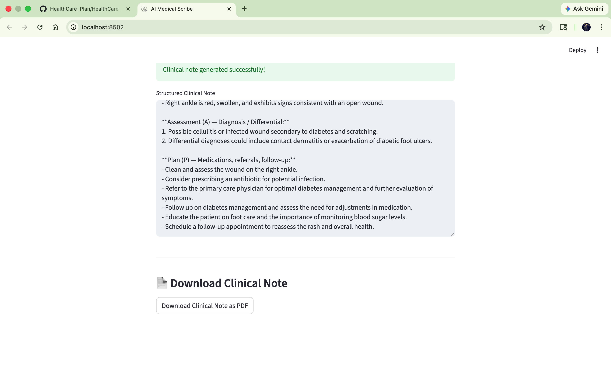

# AI Medical Scribe

A Streamlit web app that converts doctor-patient conversations into structured clinical notes using OpenAI Whisper for transcription and GPT-4o-mini for note generation.

## Features

- **Audio transcription** — record live audio or upload a file; transcribed via OpenAI Whisper
- **Speaker diarization** — GPT-4o-mini labels each turn as `Doctor:` or `Patient:`
- **Clinical note generation** — produces structured notes in four formats:
  - SOAP (Subjective, Objective, Assessment, Plan)
  - DAP (Data, Assessment, Plan)
  - Psychiatry
  - Pediatrics
- **PDF export** — download the generated note as a formatted PDF

## Project Structure

```
HealthCare_Plan/
├── main_app.py              # Streamlit entry point
├── requirements.txt
├── app/
│   ├── config.py            # API key, OpenAI client, note templates
│   ├── services/
│   │   ├── transcription.py # Whisper transcription
│   │   ├── diarization.py   # Speaker labeling via GPT-4o-mini
│   │   └── note_generator.py# Clinical note generation via GPT-4o-mini
│   └── ui/
│       ├── patient_info.py  # Patient/doctor info form
│       ├── audio.py         # Audio recorder/uploader UI
│       ├── clinical_note.py # Note display UI
│       └── pdf_export.py    # PDF generation and download
└── tests/
    └── test_prompt.py
```

## Setup

**1. Clone the repo and install dependencies**

```bash
pip install -r requirements.txt
```

**2. Set your OpenAI API key**

Create a `.env` file in the project root:

```
OPENAI_API_KEY=sk-...
```

**3. Run the app**

```bash
streamlit run main_app.py
```

## Usage

1. Fill in the patient and doctor details in the sidebar form.
2. Record audio or upload an audio file of the conversation.
3. Transcribe the audio — the app will also label Doctor/Patient turns.
4. Select a note template and generate the clinical note.
5. Download the note as a PDF.

## Screenshots

**Audio upload with speaker diarization option**



**Audio uploaded and ready to transcribe**



**SOAP note generated from transcript**



**Full note with Assessment & Plan + PDF download**



## Requirements

- Python 3.9+
- OpenAI API key with access to `whisper-1` and `gpt-4o-mini`